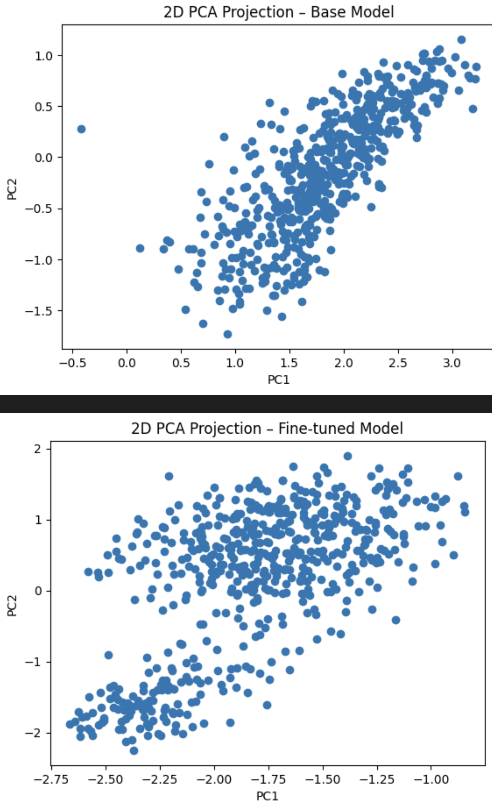

# Book Recommendation Engine

## Опис завдання

*Створити класифікатор, який підбирає до книги найбільш релевантні категорії із запропонованого списку. Описати алгоритм оцінки результатів та запропоновані метрики.*

Для виконання цього завдання модель ранжування microsoft_mpnet-base яка рахує репрезентації Назв фільмів та Категорій та пробує мінімізувати cosine similarity між відповідними рядками

Для того щоб подивитись результат натренованої моделі я зробив UI на якому можна ввести назву фільму та буде підібрано топ 15 відповідних категорій з файлу 
data/category.csv


Перш ніж виконувати скрипти створіть середовище за допомогою pyenv та встановіть залежності


```bash
pip install -r requirements.txt
```

Для коректного логування та трекінгу експериментів потрібно створити файл .env у корені проекту з такими змінними:

```
WANDB_PROJECT=ваш_проект
WANDB_LOG_MODEL=checkpoint
WANDB_WATCH=all
WANDB_API_KEY=ващ_ключ
```

## 1. Запуск демонстраційного застосунку

Для швидкого ознайомлення з роботою рекомендаційної системи можна запустити наступний скрипт:

```bash
docker build -t my-streamlit-app .

docker run -p 8501:8501 my-streamlit-app
```

Далі можна відкрити URL в браузері для тестування за портом 8501

[http://0.0.0.0:8501](http://0.0.0.0:8501)

---

## Скрипти

### 1. Генерація train/val/test спліту

```bash
python scripts/split.py
```

#### Пояснення вибору спліту

* **Test size = 10% (test\_size=0.1):** невеликий відсоток робить оцінку надійною, але зберігає достатньо даних для навчання.
* **Validation size = 30% до залишку (val\_size=0.3):** дозволяє відслідковувати метрики під час тренування без витягнення забагато даних із навчального набору.
* **Використання унікальних заголовків (`anchor`) при розбитті:** гарантує, що жодна книга (за назвою) не з'явиться одночасно і в навчальному, і в валідаційному чи тестовому наборі. Це запобігає витоку інформації між сетами.
* **Фіксований seed = 42:** забезпечує відтворюваність результатів спліту при кожному виконанні.

### 2. Валідація метрик

```bash
python scripts/eval.py
```

### 3. Тренування моделі

```bash
python scripts/train.py
```

---

## 2. Метод пошуку найрелевантніших категорій

Я обрав bi-directional encoder архітектуру для зіставлення книги з потенційними категоріями.

* **Ідея:** водночас відтворювати векторні представлення і для книги, і для кожної категорії, а потім вимірювати косинусну близькість між ними.
* **Переваги:**

  * дає змогу краще захоплювати контекст із обох сторін тексту
  * підвищена стійкість до нюансів — модель навчається розуміти, як саме окремі частини опису книги співвідносяться з різними категорійними ознаками.

## 3. Визначення метрик якості

Щоб оцінити реальну користь рекомендацій, ми вимірюємо:

* **Precision\@K** корисна, коли нам важливо мінімізувати «сміття» у верхніх позиціях.
* **Recall\@K** важлива, коли потрібно «покрити» якомога більше релевантного за перші K.
* **mAP** і **mAP\@K** поєднують у собі обидва аспекти, штрафуючи як за пізнє знаходження релевантних, так і за наявність нерелевантних між ними.

## 4. Трекінг експериментів

Для прозорого та відтворюваного аналізу результатів я використовую **Weights & Biases**:

Найкраще тренування:
[https://wandb.ai/urik-voevidka-ukrainian-catholic-university/sentence-transformers/runs/udz5qkc0](https://wandb.ai/urik-voevidka-ukrainian-catholic-university/sentence-transformers/runs/udz5qkc0)

## 5. Потенційне покращення: зворотний зв’язок від користувача

Щоб ще більше підвищити релевантність рекомендацій, я запроваджую механізм **онлайн-коригування**:

* Користувач бачить запропоновану категорію і може її «лайкнути» або «дизлайкнути»
* Зібрані реакції надходять у реаль­ному часі й використовуються для донавчання моделі або для коригування вагів у ранжуванні

## 6. Результати

### Результати на тестовому сеті до тренування

| Метрика                   | Значення |
| :------------------------ | :------: |
| **Precision\@1 (P\@1)**   |  0.0190  |
| **Precision\@5 (P\@5)**   |  0.0171  |
| **Precision\@10 (P\@10)** |  0.0132  |
| **Recall\@1 (R\@1)**      |  0.0103  |
| **Recall\@5 (R\@5)**      |  0.0472  |
| **Recall\@10 (R\@10)**    |  0.0730  |
| **Mean AP (mAP)**         |  0.0404  |
| **Mean AP\@15 (mAP\@15)** |  0.0290  |

### Результати на тестовому сеті після тренування

| Метрика                   | Значення |
| :------------------------ | :------: |
| **Precision\@1 (P\@1)**   |  0.6967  |
| **Precision\@5 (P\@5)**   |  0.5131  |
| **Precision\@10 (P\@10)** |  0.4467  |
| **Recall\@1 (R\@1)**      |  0.0485  |
| **Recall\@5 (R\@5)**      |  0.1763  |
| **Recall\@10 (R\@10)**    |  0.3062  |
| **Mean AP (mAP)**         |  0.4284  |
| **Mean AP\@15 (mAP\@15)** |  0.2698  |


## 7. PCA

Для порівняння я спроектував репрезентації Категорій з тестового файлу натренованої і базової моделі на 2D графіку.
Можна спостерігати, що після тренування ембедінги стали більше розрідженими.



*Результат ноутбуку `notebooks/pca_comparison.ipynb`*

Посилання на натреновану модель на Hugging Face:
[`yuriivoievidka/microsoft_mpnet-base-librarian`](https://huggingface.co/yuriivoievidka/microsoft_mpnet-base-librarian)
